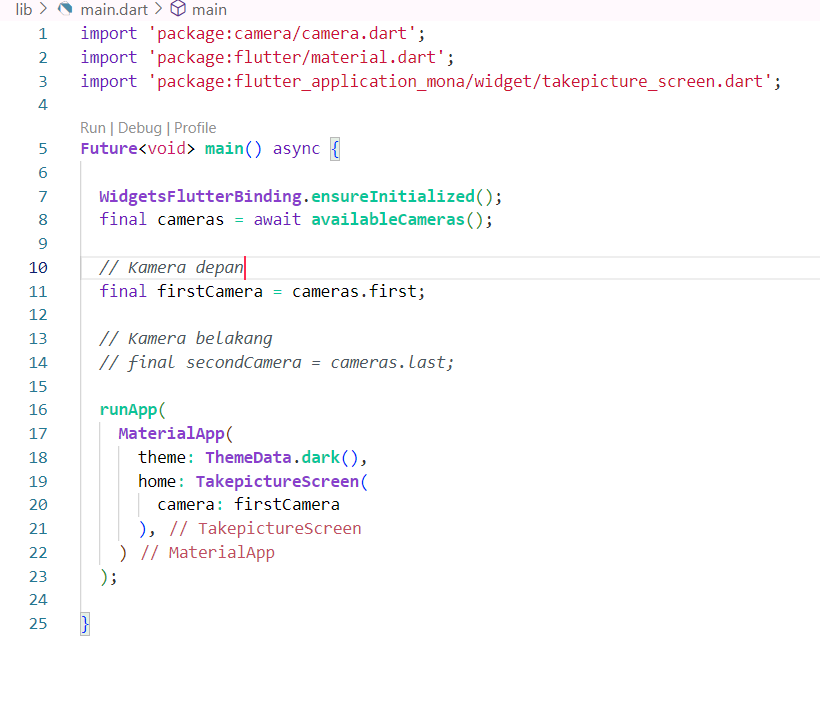
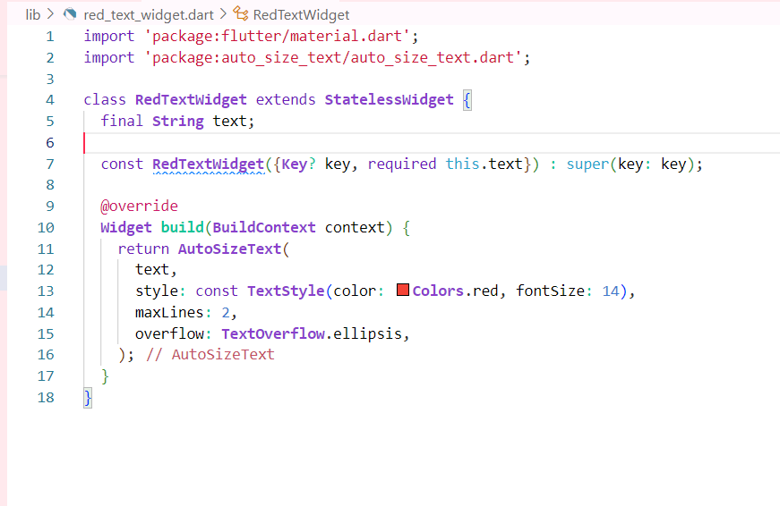
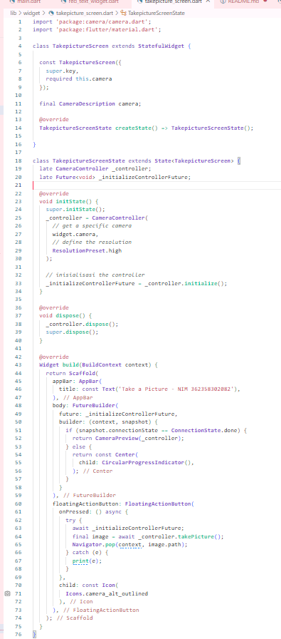
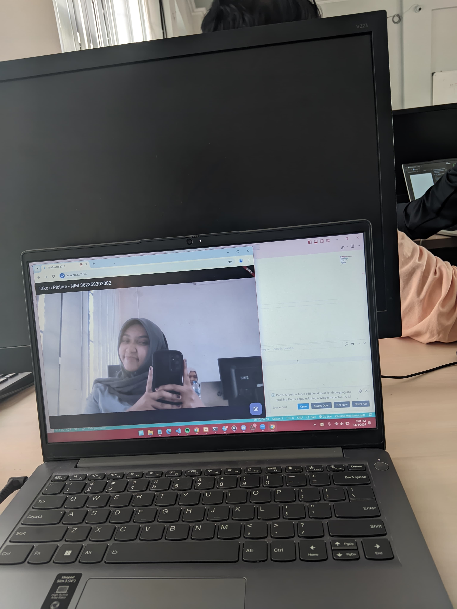

tugas 1 dan 2
 
   camera.dart berfungsi untuk mengakses kamera, main function untuk inisalisasi dan ketersediaan kamera

   
menampilkan teks dengan ukuran yang dapat di sesuaikan, material.dart  untuk mengakses komponen material design,seperti colors.

fungsi utama memungkin kan pengguna untuk membuka kamera,menunggu hingga kamera siap lalu mengambil gambar.

hasil : 

4. Breaking Change berhubungan dengan perubahan signifikan yang mengharuskan modifikasi kode agar tetap kompatibel dengan plugin yang    diperbarui.
Plugin Not Working lebih kepada plugin tidak berfungsi sesuai harapan, seringkali disebabkan oleh bug.
PR Not Merged adalah situasi di mana solusi masalah sudah ada tetapi belum di-merge secara resmi, sehingga perlu dependency_override untuk menggunakannya.
Inconsistent Dependencies terjadi karena versi plugin yang bentrok antar-dependensi, seringkali diatasi dengan memperbarui atau menyesuaikan versi plugin.
MissingPluginException biasanya diatasi dengan membersihkan proyek karena terjadi masalah dalam inisialisasi plugin.

5.1. text
Deskripsi: Teks yang akan ditampilkan dalam widget.
Tipe: String
Contoh: "Hello, World!"

2. style
Deskripsi: Mengatur gaya teks seperti warna, ukuran font awal, ketebalan, dan lainnya.
Tipe: TextStyle
Contoh: TextStyle(fontSize: 20, color: Colors.blue)

3. minFontSize
Deskripsi: Menentukan ukuran font minimum yang bisa dicapai saat teks mengecil. Jika ukuran teks harus lebih kecil dari nilai ini agar bisa muat, maka teks tetap akan menggunakan minFontSize.
Tipe: double
Default: 12
Contoh: minFontSize: 10

TUGAS 2
